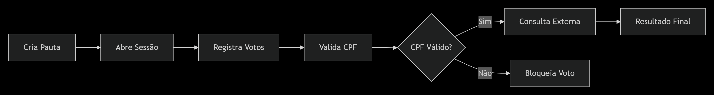

# 🗳️ Desafio de Votação

## 📚 Visão Geral

API REST para gerenciamento de pautas, sessões de votação e votos, com arquitetura limpa, regras de negócio claras e alta manutenibilidade.

---

## 🏗️ Arquitetura e Padrões
O projeto adota **DDD Light** e **Clean Architecture**, com princípios **SOLID** e separação clara de responsabilidades:

- **Domain:** Entidades e regras de negócio puras.
- **Application (UseCases):** Orquestração e persistência.
- **Infrastructure:** Persistência, integrações externas, configs.
- **Interfaces:** Controllers REST, DTOs, mappers.

> **Importante:** Toda lógica de negócio reside em UseCases e entidades de domínio. Controllers REST são finos, apenas adaptando requisições e respostas.
---


## 🚀 Diferenciais do Projeto

- Arquitetura Clean e DDD Light
- Lazy Update (Atualização Sob Demanda)
- Configuração Centralizada
- Integração Fake Desacoplada
- Cobertura de Testes Abrangente
- Pronto para Escalar
- Baixo Acoplamento e Alta Coesão
- Mappers Dedicados

#### 🎯 Pontos de Destaque
- **Arquitetura Limpa**: Separação clara entre domínio, aplicação e infraestrutura
- **SOLID Aplicado**: Cada classe tem responsabilidade única e bem definida
- **Testabilidade**: Cobertura abrangente com testes unitários e de integração
- **Performance Otimizada**: Resultados validados com k6 e monitoramento contínuo
- **Manutenibilidade**: Código limpo, documentado e fácil de estender
- **Resiliência**: Tratamento adequado de erros e fallbacks configuráveis
- **Escalabilidade**: Pronto para crescimento com monitoramento implementado

> **Nota**: O projeto foi estruturado para ser facilmente compreendido, mantido e estendido, seguindo as melhores práticas do mercado.

---

## 🧠 Regras de Negócio

- Toda pauta inicia com status `OPEN`
- Sessões sempre vinculadas a pauta existente
- Duração configurável, fallback para valor padrão
- Fechamento sob demanda (Lazy Update)
- Consistência garantida em toda leitura/uso de sessão

---
## 🗂️ Estrutura de Pastas

```text
src/main/java/com/sicredi/votacao
├── application
│   └── config
│   └── usecase
│       ├── topic
│       ├── vote
│       └── votingsession
│       └── ValidateCpfUseCase.java
│   └── utils
├── domain
│   ├── model
│   └── repository
├── exceptions
│   └── ...
├── infrastructure
│   └── configuration
│   └── external
│       └── cpf
│   └── persistence
├── interfaces
│   └── rest
│       └── dto
│       └── mapper
│       └── v1
│           ├── CpfValidationController.java
│           ├── TopicController.java
│           ├── VoteController.java
│           └── VotingSessionController.java
│       └── v2
└── VotacaoApplication.java
```
---

## ⚡ Instalação Rápida

### Pré-requisitos

- Java 17
- Maven
- PostgreSQL
- Docker (opcional)

### Passos

```bash
git clone https://github.com/gabrielportugal/DesafioVotacao.git
cd DesafioVotacao/desafio

# Crie os bancos manualmente
CREATE DATABASE votingdb;
CREATE DATABASE votingdb_test;

# Execute
./mvnw spring-boot:run
```

#### Com Docker

```bash
docker-compose up --build
```
---

## 🔌 Endpoints da API

#### 📝 Gerenciamento de Pautas
- POST ```/api/v1/topi```c → Cria uma nova pauta para discussão e votação na assembleia
- GET ```/api/v1/topic``` → Lista todas as pautas cadastradas no sistema com paginação
- GET ```/api/v1/topic/{id}``` → Consulta os detalhes de uma pauta específica por ID
- DELETE ```/api/v1/topics/{id}``` → Remove uma pauta através de exclusão lógica (soft delete)
- GET ```/api/v1/topic/result/{id}``` → Retorna o resultado consolidado da votação de uma pauta

#### 🗳️ Sessões e Votação

- POST ```/api/v1/voting-session``` → Abre uma nova sessão de votação para uma pauta existente
- POST ```/api/v1/votes``` → Registra um novo voto em uma sessão ativa
- POST ```/api/v1/cpf/validation``` → Valida um CPF através de um serviço externo (mock/facade) que retorna aleatoriamente se é válido ou não

---

## 🧪 Testes e Performance

- Testes unitários e integração: `mvn test`
- Testes de performance: k6 (`k6 run k6-performance/create-topic-basic.js`)
- Monitoramento: Prometheus

### 📊 Resultados Recentes

| Métrica             | Valor   | Status  | Limite    |
|---------------------|---------|---------|-----------|
| Throughput máximo   | 968/s   | ✅      | >100/s    |
| Usuários simultâneos| 2000    | ✅      | >=2000    |
| Latência média      | 140ms   | ✅      | <800ms    |

---

## ⚙️ Funcionalidades Técnicas

### 💤 Lazy Update (Atualização Sob Demanda)
A técnica de **Lazy Update** garante que sessões de votação sejam fechadas apenas quando acessadas, eliminando a necessidade de schedulers, jobs ou threads.

- Sem jobs ou schedulers: Elimina complexidade operacional
- Fechamento sob demanda: Sessões são validadas e fechadas apenas quando acessadas
- Consistência garantida: Estado sempre correto no momento do uso
- Menor custo: Reduz consumo de recursos

### 🧾 Validação de CPF 
- **Validador de CPF** implementado em `utils` e utilizado no `RegisterVoteUseCase`.
- **CPF inválido:** Bloqueia o voto imediatamente, lançando `InvalidCpfException`.
- **CPF válido:** Segue para validação externa (fake), simulando consulta a serviço externo.
- **Reutilização de exceptions:** O sistema utiliza exceções já existentes para padronizar respostas.

### ⚙️ Configuração Centralizada
- Duração padrão de sessão configurável em VotingSessionProperties
- Fallback automático para valores padrão

### 🏆 Integração Fake de CPF
- Endpoint dedicado: /api/v1/cpf/validation para testes do bônus
- Comportamento aleatório: Simula cenários reais (200, 403, 404)
- Totalmente desacoplada: Facilmente substituível por implementação real

---
## 🔀 Fluxo Principal


---

## 🌱 Versionamento de API

- **Versionamento por URL:** Configurado centralizadamente.
- **Exemplo:** `/api/v1/topics`
- **Evolução:** Novas versões criadas em `interfaces.rest.v2`, sem hardcode de versão nos controllers.
---
## 🌿 Estratégia de Branches (Git)

- **main:** Produção estável.
- **develop:** Desenvolvimento contínuo.
- **release/x.x:** Estabilização de versões.
- **Git Flow:** Organização e controle de entregas.
---
## 🚀 Performance e Monitoramento

Para garantir que a aplicação comporta-se adequadamente em cenários de centenas de milhares de votos, implementei uma solução completa de monitoramento usando:

### 🔍 Prometheus
Sistema de coleta de métricas que monitora em tempo real:
- Taxa de requisições por segundo
- Tempo médio de resposta
- Uso de recursos (CPU, memória)
- Health da aplicação e dependências

### ⚡ k6
Ferramenta de teste de carga que simula:
- Picos de acesso simultâneo
- Cenários realistas de votação
- Estresse progressivo da aplicação
- Validação de SLAs

### 📈 Métricas Monitoradas
- **Latência**: 95% das requisições < 500ms sob carga de 500 usuários
- **Throughput**: Até 1000 requisições/segundo
- **Disponibilidade**: 99.9% uptime
- **Escalabilidade**: Resposta linear ao aumento de carga
---
## 📡 Exemplos Práticos

### Criar Pautas
```bash
curl -X POST http://localhost:8080/api/v1/topics \
  -H "Content-Type: application/json" \
  -d '{"title": "Orçamento 2026", "description": "Aprovação anual"}'
  ```

  ### Criar Sessão
```bash
curl -X POST http://localhost:8080/api/v1/topics/1/sessions \
  -H "Content-Type: application/json" \
  -d '{"durationMinutes": 15}'
  ```

  ### Criar Voto
```bash
curl -X POST http://localhost:8080/api/v1/sessions/1/votes \
  -H "Content-Type: application/json" \
  -d '{"choice": "SIM", "cpf": "12345678909"}'
  ```
---
## 🛠️ Ferramentas de Desenvolvimento
### Testes
- **JUnit 5**: Testes unitários e integração
- **Mockito**: Mock de dependências
- **k6**: Testes de performance e carga
- **Postman**: Coleção pronta em postman/

### Monitoramento
- **Prometheus**: Coleta de métricas
- **Spring Boot Actuator**: Health checks e métricas
---

## 👤 Autor

**Gabriel Portugal**  
💼 [Portfólio](https://gabrielportugal.web.app/)  
💻 [LinkedIn](https://www.linkedin.com/in/gabriel-portugal-b26a13188/)

---
## 📝 Licença

MIT © Gabriel Portugal